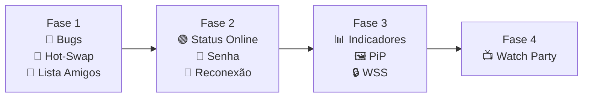

# 🚀 Plano de Implementação — Radmin Stream Live v2

> ✅ **Status: implementado (v1.0.13)** — Fases 1-4 concluídas. Notas de implementação:
> - **Reconexão (2.3)**: máximo 10 tentativas a cada 5s, controlada manualmente via `Websocket.Client`.
> - **Criptografia (3.3)**: optou-se pela alternativa mais simples sugerida no plano — AES no payload (sinalização + áudio), chave derivada (SHA-256) da senha da sala, sem WSS/certificado. Só ativa quando a sala tem senha.
> - **Latência (3.1)**: medida via ping/pong no WebSocket de sinalização (round-trip real da conexão), não RTCP nativo do SIPSorcery — API instável nessa versão da lib.
> - **Watch Party (4.1)**: implementado como modo **aditivo** ("Watch Party"), separado do fluxo padrão "Join Stream" (que continua intacto). Permite conectar a vários amigos simultaneamente, com alternância entre abas (`TabControl`) e grid 2x2.
> - Testado via `dotnet build` (sem erros). Fluxos de rede/UI precisam de validação manual rodando o app (host + client) já que não há ambiente para múltiplas instâncias de GUI aqui.
> - **Correções (revisão pós-implementação)**: 2 lacunas do item 1.3 ficaram pela metade e foram fechadas — (a) `CboFriends` (editável) não atualizava o texto ao selecionar um amigo da lista, pois faltava `TextSearch.TextPath="Ip"`, então o clique em "Connect" enviava o `ToString()` do objeto em vez do IP; (b) o botão "+" não pedia apelido como o plano especificava, apenas duplicava o IP como nome — agora abre `AddFriendDialog` (novo) pedindo o apelido antes de salvar. Não foi possível rodar `dotnet build`/`MSBuild` neste ambiente (SDK do .NET não está instalado, só o runtime) — revisão feita por leitura de código; recomenda-se compilar localmente antes de publicar.

Baseado nos seus comentários. Organizado em **4 fases** por dependência e prioridade.

---

## Fase 1 — Fundação (Bugs + Core Features)

> Corrigir a base e implementar as features mais impactantes primeiro.

---

### 1.1 🐛 Correção de Bugs Técnicos

**Arquivos afetados:**

- [SignalingServer.cs](file:///d:/Projetos%20em%20andameto/app-live/Network/SignalingServer.cs)
- [MainWindow.xaml.cs](file:///d:/Projetos%20em%20andameto/app-live/MainWindow.xaml.cs)
- [StreamManager.cs](file:///d:/Projetos%20em%20andameto/app-live/Core/StreamManager.cs)

**Mudanças:**

#### Thread Safety do `_clients`

- Trocar `List<IWebSocketConnection>` por acesso com `lock` em `SignalingServer`
- Proteger `BroadcastBinary`, `BroadcastMessage`, `OnOpen`, `OnClose`

#### Eliminar Reflection do `_clients`

- Adicionar método público `SendToClient(string clientId, string message)` no `SignalingServer`
- Remover o acesso via `GetType().GetField("_clients", ...)` do `MainWindow.xaml.cs`

#### Limpeza de PeerConnection ao Desconectar

- No `SignalingServer.OnClientDisconnected`, notificar o `StreamManager` para fechar e remover o `RTCPeerConnection` do client que saiu

#### Áudio do Discord — Manter como Está

- Você explicou que o objetivo é **excluir** o áudio do Discord (call) da transmissão, capturando o áudio do sistema exceto o Discord. Faz total sentido — isso não é bug, é feature ✅

---

### 1.2 🔄 Hot-Swap de Tela (Trocar Source sem Pausar)

**Arquivos afetados:**

- [MainWindow.xaml](file:///d:/Projetos%20em%20andameto/app-live/MainWindow.xaml)
- [MainWindow.xaml.cs](file:///d:/Projetos%20em%20andameto/app-live/MainWindow.xaml.cs)
- [StreamManager.cs](file:///d:/Projetos%20em%20andameto/app-live/Core/StreamManager.cs)

**Mudanças:**

1. **Manter `CboWindows` habilitado** durante o streaming
2. Adicionar evento `CboWindows_SelectionChanged`:
   ```
   Quando a seleção mudar durante stream:
     → _streamManager.SetTargetSource(novaSource)
     → _streamManager.ForceKeyFrame()
     → _server.BroadcastMessage("SOURCE_CHANGED")
   ```
3. Adicionar método `ForceKeyFrame()` público no `StreamManager`
4. No lado do viewer: ao receber `SOURCE_CHANGED`, mostrar brevemente "Host trocou de tela" no `StatusText`

---

### 1.3 📇 Lista de Amigos (Salvar IPs)

**Arquivos novos:**

- `Models/Friend.cs` — modelo de dados
- `Services/FriendsService.cs` — CRUD do JSON

**Arquivos modificados:**

- [MainWindow.xaml](file:///d:/Projetos%20em%20andameto/app-live/MainWindow.xaml)
- [MainWindow.xaml.cs](file:///d:/Projetos%20em%20andameto/app-live/MainWindow.xaml.cs)

**Mudanças:**

1. **Modelo `Friend`**:

   ```csharp
   public class Friend
   {
       public string Name { get; set; }    // "João"
       public string Ip { get; set; }      // "26.10.0.5"
   }
   ```

2. **`FriendsService`**: salva/carrega de `%AppData%/RadminStreamApp/friends.json`

3. **Nova UI no `PanelClient`**:
   - Substituir o TextBox `TxtHostIp` por um **ComboBox editável** com os amigos salvos
   - Ao lado: botão **"+"** para adicionar o IP atual à lista (pede apelido)
   - Ao lado: botão **"🗑"** para remover da lista
   - O usuário ainda pode digitar um IP manualmente (ComboBox é editável)
   - Layout: `[ComboBox amigos ▼] [+] [🗑] [Connect] [Disconnect]`

4. **Indicadores visuais** (preparação para Fase 2):
   - Cada item da lista mostra o nome do amigo
   - Espaço reservado para bolinha de status (🟢/🔴) que será implementada na Fase 2

---

## Fase 2 — Conectividade Inteligente

> Features que melhoram a conexão e acesso.

---

### 2.1 🟢 Verificação de Status (Online / Em Live)

**Arquivos afetados:**

- [SignalingServer.cs](file:///d:/Projetos%20em%20andameto/app-live/Network/SignalingServer.cs)
- [SignalingClient.cs](file:///d:/Projetos%20em%20andameto/app-live/Network/SignalingClient.cs)
- [MainWindow.xaml.cs](file:///d:/Projetos%20em%20andameto/app-live/MainWindow.xaml.cs)
- `Services/FriendsService.cs`

**Mudanças:**

#### Handshake de Status (Opção B)

1. O `SignalingServer` rastreia se há stream ativo (`_isStreaming = true/false`)
2. Ao receber conexão de client:
   - Client envia `{ Type: "STATUS_CHECK" }`
   - Server responde `{ Type: "STATUS_RESPONSE", Data: "STREAMING" }` ou `{ Data: "IDLE" }`
   - Se `IDLE` → client mostra **"Host não está em live"** e desconecta
   - Se `STREAMING` → procede com o fluxo normal

#### Indicador na Lista de Amigos (Opção C)

1. Ao abrir o app no modo Client, faz um **ping TCP na porta 8080** de cada amigo em background
2. Se o app está aberto e respondendo → mostra 🟡 (online, mas pode não estar em live)
3. Se faz o handshake e está `STREAMING` → mostra 🟢 (em live!)
4. Se não responde → mostra 🔴 (offline)
5. Atualiza a cada **30 segundos** automaticamente
6. O ping é **leve** — só abre e fecha a conexão TCP, sem trocar dados pesados

---

### 2.2 🔑 Senha de Sala (Opcional)

**Arquivos afetados:**

- [MainWindow.xaml](file:///d:/Projetos%20em%20andameto/app-live/MainWindow.xaml)
- [MainWindow.xaml.cs](file:///d:/Projetos%20em%20andameto/app-live/MainWindow.xaml.cs)
- [SignalingServer.cs](file:///d:/Projetos%20em%20andameto/app-live/Network/SignalingServer.cs)

**Comportamento:**

- No painel Host: campo opcional **"Senha da Sala"** (TextBox pequeno ao lado do Start)
- **Se vazio** → qualquer um entra livremente, sem pedir senha ✅
- **Se preenchido** → o fluxo muda:
  1. Client conecta no WebSocket
  2. Server envia `{ Type: "AUTH_REQUIRED" }`
  3. Client mostra popup pedindo a senha
  4. Client envia `{ Type: "AUTH", Data: "senha123" }`
  5. Server valida:
     - ✅ Correta → `{ Type: "AUTH_OK" }` → procede normal
     - ❌ Errada → `{ Type: "AUTH_FAIL" }` → desconecta e mostra erro

---

### 2.3 🔄 Reconexão Automática

**Arquivos afetados:**

- [MainWindow.xaml.cs](file:///d:/Projetos%20em%20andameto/app-live/MainWindow.xaml.cs)
- [SignalingClient.cs](file:///d:/Projetos%20em%20andameto/app-live/Network/SignalingClient.cs)

**Mudanças:**

1. O `Websocket.Client` já tem reconexão automática de WebSocket embutida
2. O que falta: **reiniciar o fluxo WebRTC** quando o WebSocket reconecta
3. Ao detectar reconexão:
   - Limpar o `StreamManager` antigo
   - Criar novo `StreamManager`
   - Reenviar `CLIENT_CONNECTED` / `STATUS_CHECK`
   - Mostrar "Reconectando..." no `StatusText`
4. Tentativas: a cada **5 segundos**, máximo **10 tentativas**
5. Se host parou a live (recebeu `STREAM_STOPPED`), **não tenta reconectar** (é intencional)

---

## Fase 3 — Polish & Extras

> Features que melhoram a experiência mas não são bloqueantes.

---

### 3.1 📊 Indicador de Qualidade / Latência

**Arquivos afetados:**

- [MainWindow.xaml](file:///d:/Projetos%20em%20andameto/app-live/MainWindow.xaml)
- [MainWindow.xaml.cs](file:///d:/Projetos%20em%20andameto/app-live/MainWindow.xaml.cs)
- [StreamManager.cs](file:///d:/Projetos%20em%20andameto/app-live/Core/StreamManager.cs)

**Visível para: Host E Viewer** (cada um vê métricas diferentes)

| Métrica            | Host           | Viewer                  |
| ------------------ | -------------- | ----------------------- |
| FPS de captura     | ✅             | ❌                      |
| FPS de decode      | ❌             | ✅                      |
| Bitrate de envio   | ✅             | ❌                      |
| Viewers conectados | ✅ (já existe) | ❌                      |
| Latência estimada  | ❌             | ✅ (via RTCP do WebRTC) |

**UI**: Pequeno painel semi-transparente no canto inferior esquerdo do vídeo, mostrando:

- Host: `📤 30fps | 4.2 Mbps`
- Viewer: `📥 28fps | 45ms`

---

### 3.2 🖼️ Picture-in-Picture (PiP)

**Arquivos novos:**

- `PipWindow.xaml` + `PipWindow.xaml.cs` — janela mini-player

**Arquivos modificados:**

- [MainWindow.xaml](file:///d:/Projetos%20em%20andameto/app-live/MainWindow.xaml)
- [MainWindow.xaml.cs](file:///d:/Projetos%20em%20andameto/app-live/MainWindow.xaml.cs)

**Mudanças:**

1. Botão novo nos controles do viewer: **"⬆ PiP"**
2. Ao clicar, abre uma `PipWindow`:
   - Sempre visível (`Topmost = true`)
   - Sem borda (`WindowStyle = None`)
   - Tamanho pequeno (~320x180), redimensionável
   - Arrastável por qualquer lugar
   - Recebe o mesmo `WriteableBitmap` do `VideoPlayer`
   - Duplo-clique na PipWindow → volta para a janela principal
3. A janela principal pode ser minimizada enquanto o PiP fica visível

---

### 3.3 🔒 Criptografia WebSocket (WSS)

**Arquivos afetados:**

- [SignalingServer.cs](file:///d:/Projetos%20em%20andameto/app-live/Network/SignalingServer.cs)
- [SignalingClient.cs](file:///d:/Projetos%20em%20andameto/app-live/Network/SignalingClient.cs)

**Mudanças:**

1. Na primeira execução, gerar um certificado auto-assinado X.509 e salvar em `%AppData%/RadminStreamApp/cert.pfx`
2. O `Fleck` já suporta WSS nativamente — basta configurar o certificado:
   ```csharp
   _server = new WebSocketServer("wss://0.0.0.0:8080");
   _server.Certificate = new X509Certificate2("cert.pfx");
   ```
3. O client conecta via `wss://` em vez de `ws://`

> [!WARNING]
> Certificados auto-assinados podem dar avisos no Windows. Uma alternativa mais simples é manter `ws://` mas criptografar o payload das mensagens com AES (chave derivada da senha da sala). Isso é mais transparente e sem fricção. Deixo para você decidir qual prefere.

---

## Fase 4 — Feature Avançada

### 4.1 📺 Múltiplos Streams Simultâneos (Watch Party)

**Complexidade**: Alta — esta é a maior mudança arquitetural

**Arquivos novos:**

- `StreamTab.xaml` + `StreamTab.xaml.cs` — componente de viewer individual

**Conceito:**

1. O viewer pode se conectar a **vários hosts ao mesmo tempo**
2. A UI muda de um `Image` único para um `TabControl` com abas:
   - Cada aba = uma stream de um amigo diferente
   - Aba mostra o nome do amigo (da lista de amigos)
3. Cada aba tem seu próprio `SignalingClient` + `StreamManager`
4. Opção de **layout em grid** (2x2, etc.) para ver todos ao mesmo tempo

> [!IMPORTANT]
> Esta feature depende das Fases 1-3 estarem concluídas. Cada stream consome CPU para decodificar H264, então múltiplos streams simultâneos vai exigir otimização.

---

## 📅 Resumo da Ordem de Execução



| Fase       | Itens                             | Esforço Estimado |
| ---------- | --------------------------------- | ---------------- |
| **Fase 1** | Bugs + Hot-Swap + Lista Amigos    | ~1 sessão        |
| **Fase 2** | Status Online + Senha + Reconexão | ~1 sessão        |
| **Fase 3** | Indicadores + PiP + WSS           | ~1-2 sessões     |
| **Fase 4** | Watch Party                       | ~2 sessões       |

---

## ❓ Perguntas Abertas

1. **Criptografia WSS**: Prefere certificado auto-assinado (WSS nativo) ou criptografia AES no payload (mais simples, sem avisos do Windows)?
   Simples, sem avisos do Windows
2. **Indicadores de qualidade**: Confirmado que quer ver métricas tanto no Host quanto no Viewer (cada um vê dados diferentes), certo?
   sim
3. **PiP**: O mini-player deve ter controle de volume próprio, ou usa o volume da janela principal?
   controle de volume próprio
